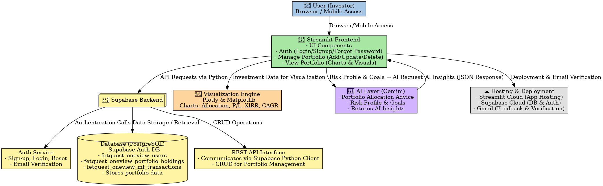

# 🪙 The FETQuest OneView

**The FETQuest OneView** is a simple and intuitive **Investment Portfolio Dashboard** designed for Indian investors.  
It helps you manage and visualize your holdings in **Stocks**, **Mutual Funds**, and **Gold**, without overwhelming data or complex screens.

🔗 **Live App:** [https://fetquest-oneview.streamlit.app/](https://fetquest-oneview.streamlit.app/)

---

## 🧭 Getting Started

> 💡 **First-time users must sign up and verify their email before logging in.**

1. **Sign Up:** Create your account with a valid email ID.  
2. **Verify Email:** Check your inbox for the verification link and confirm your email.  
3. **Login:** Once verified, sign in and start managing your portfolio.  
4. **Forgot Password:** Use the “Forgot Password” link on the login screen to reset it anytime.

---

## 🌟 Key Features

### 🧾 Manage Portfolio
Add and manage all your investments in one place:
- **Stocks:** Add or update your stock holdings with quantity and average price.  
- **Mutual Funds:** Add SIP/SWP investments for accurate **CAGR** and **XIRR** tracking.  
- **Gold:** Track physical gold (22K/24K) and update investments easily.  
- You can also **delete or modify** existing investments at any time.

---

### 📊 View Portfolio
Visualize your investments with meaningful insights and clean visuals:

#### 🧩 Consolidated View
Get an **overall snapshot** of your entire portfolio — across Stocks, Mutual Funds, and Gold — with:
- Asset-wise allocation charts  
- Invested vs. current value  
- Profit/Loss analysis  
- **AI Portfolio Recommendation** – A fully AI-curated investment suggestion based on your **risk profile** and **financial goal** (e.g., Wealth Growth, Retirement Corpus, or Child’s Education).  
  > ⚠️ *Note: This is an indicative 10-year model portfolio recommendation and should not be considered financial advice.*

#### 📈 Stock View
See detailed analytics for your stock holdings:
- Sector allocation, Market Cap (Large/Mid/Small), P/E Ratio, EPS, and Market Capitalization  
- Invested vs. Current Value and Profit/Loss per stock  
- Sector and company size distribution

#### 💰 Mutual Fund View
Monitor mutual fund performance with:
- **CAGR** and **XIRR** calculations  
- Charts by scheme type (Equity, Debt, ELSS, etc.)  
- Total invested vs. current valuation comparison

#### 🪙 Gold View
Understand your gold investments through:
- Value tracking of 22K and 24K gold holdings  
- Profit/Loss analysis (if invested value provided)

---

## 🧠 AI Portfolio Recommendation
In the **Consolidated View**, you can get AI-generated suggestions based on:
- **Risk Profile**: Conservative / Moderate / Aggressive  
- **Goal**: Wealth Growth, Retirement, Home Purchase, Child’s Education, etc.  

This AI analysis assumes a **10-year horizon** and provides an **allocation-based preview** to help restructure or balance your portfolio.

> ⚠️ *The AI recommendations are for informational purposes only and do not analyze individual assets.*

---

## 💌 Feedback & Support
If you have any feedback, suggestions, or issues, feel free to reach out at:  
📧 **daps.fetquest@gmail.com**

---
# ⚙️ Developer Guide

### 🧱 Tech Stack
- **Frontend:** Streamlit  
- **Backend / Database:** Supabase  
- **AI Layer:** OpenAI / Gemini API (for portfolio recommendations)  
- **Visualization:** Plotly / Matplotlib  
- **Data Handling:** Pandas  
- **Auth & Session:** Supabase Authentication + Streamlit Session State  

---

### 🚀 Local Setup

#### 1️⃣ Clone the Repository
```bash
git clone https://github.com/<your-username>/fetquest-oneview.git
cd fetquest-oneview

```
---

# 🏗️ System Architecture



---

**Built with ❤️ by The FET Quest using Streamlit & AI-powered insights for the Indian investors.**
